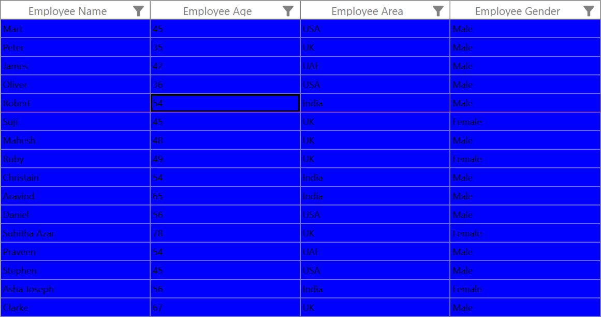
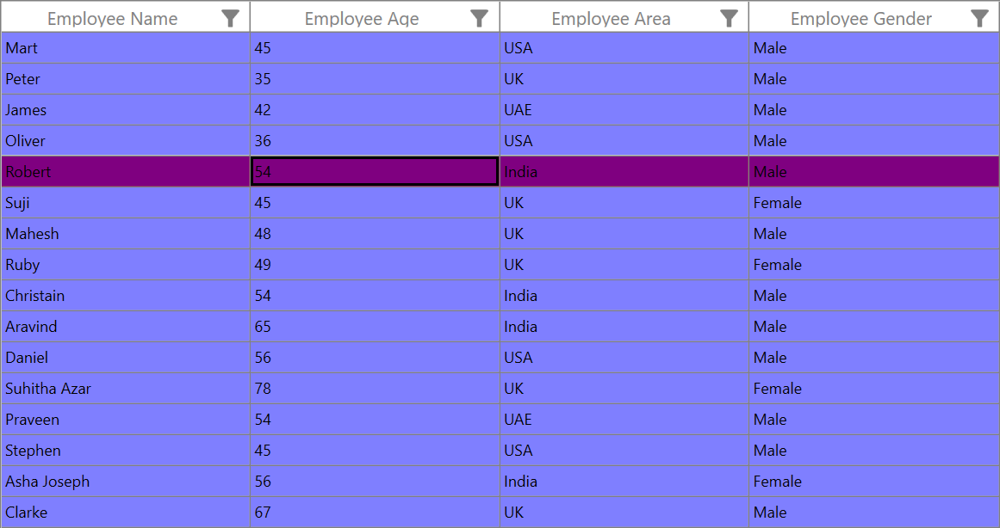

# How to show the selection of row or cell when setting the background for SfDataGrid GridCell in WPF

## Problem

[Row](https://help.syncfusion.com/cr/wpf/Syncfusion.UI.Xaml.Grid.GridSelectionUnit.html)/[Cell](https://help.syncfusion.com/cr/wpf/Syncfusion.UI.Xaml.Grid.GridSelectionUnit.html) selection border is behind the [GridCell](https://help.syncfusion.com/cr/wpf/Syncfusion.UI.Xaml.Grid.GridCell.html) content. So when you apply the background for `GridCell`, the selection is not displayed in the UI. The following code example shows you how to set the `GridCell` style.
 
 ```XML 
 
<!--Need to add this code snippet in Resources Define the style with Key-->
<Style x:Key="ApplyCellStyle" TargetType="Syncfusion:GridCell">
        <Setter Property="Background">
               <Setter.Value>
                    <SolidColorBrush Color="Blue" />
                </Setter.Value>
         </Setter>          
</Style>       

<Syncfusion:SfDataGrid x:Name="datagrid" 
                       ColumnSizer="Star" 
                       SelectionUnit="Row"  
                       AllowSelectionOnPointerPressed="True"  
                       RowSelectionBrush="Red"  
                       CellStyle="{StaticResource ApplyCellStyle}"  
                       ItemsSource="{Binding GDCSource}"  
                       SelectionMode="Single" >
</Syncfusion:SfDataGrid>

 ```

In the following screenshot, the selection is set in the 5th row, but it is not displayed in View with the selection border in the Cell Content presenter. 
 
 

## Solution

You can overcome this problem by reducing the **Opacity** for the brush that you set to the `GridCell` background. The following code example shows you how to set the **Opacity** to `GridCell`.
 
 ```XML
 
<!--Need to add this code snippet in Resources Define the style with Key-->
<Style x:Key="ApplyCellStyle" TargetType="Syncfusion:GridCell">
        <Setter Property="Background">
               <Setter.Value>
                    <SolidColorBrush Color="Blue" Opacity="0.5"/>
                </Setter.Value>
         </Setter>          
</Style>       
<Syncfusion:SfDataGrid x:Name="datagrid" 
                       ColumnSizer="Star" 
                       SelectionUnit="Row"  
                       AllowSelectionOnPointerPressed="True"  
                       RowSelectionBrush="Red"  
                       CellStyle="{StaticResource ApplyCellStyle}"  
                       ItemsSource="{Binding GDCSource}"  
                       SelectionMode="Single" >
</Syncfusion:SfDataGrid>

 ```

The following screenshot shows you the selection of row after applying the background for `GridCell`. 
 
 

Take a moment to peruse the [WPF DataGrid - Conditional Styling](https://help.syncfusion.com/wpf/datagrid/conditional-styling) documentation, where you can find about conditional styling with code examples.